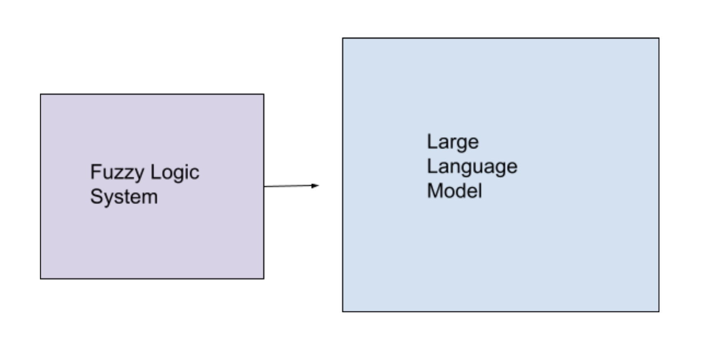

# Middleware

## Fuzzy Logic to Emulate Empathy 

### Benifits of using Fuzzy Logic as an additional system apart from a LLM

#### 1. Recongize emotional states in degrees

Instead of it being "sad"/"happy"/etc  
It would be: 

- "slightly sad"
- "very sad"
- "somewhat anxious"
- "extremly anxious"
- etc

#### 2. Contextual decision making with fuzzy sets

- Adaptive Response Levels

Example:  
*Emotion Detected:* Moderatly Anxious 
*Chatbot Response Angled:* Provide mild reasurance 

- Empathy Scaling 

#### 3. Adjusting Tone and Language with Fuzzy Logic

The system does not treat emotions as binary (e.g., "sad" or "happy") but instead recognizes degrees of emotions, allowing for subtle emotional understanding. Membership functions for variables like sadness and frustration create fuzzy sets, enabling the system to interpret inputs such as:

- "slightly sad" (low sadness)
- "very sad" (high sadness)
- "somewhat anxious" (moderate frustration)
- "extremely anxious" (high frustration)

The fuzzy logic control system adjusts the tone and language of responses based on these nuanced emotional states.  
*For example:*

- A low empathy score might trigger concise, encouraging statements like: *"I'm here to help. Tell me more about what you're feeling."*
- A moderate empathy score results in reassurance: *"It seems like you're going through a tough time. I'm here to support you."*
- A high empathy score offers deep emotional validation: *"I understand how difficult this must be for you. Let’s work together to find a way forward."*

#### 4. Handling Vague Emotional Expression 

#### 5. Building Trust: Human-like Interaction
